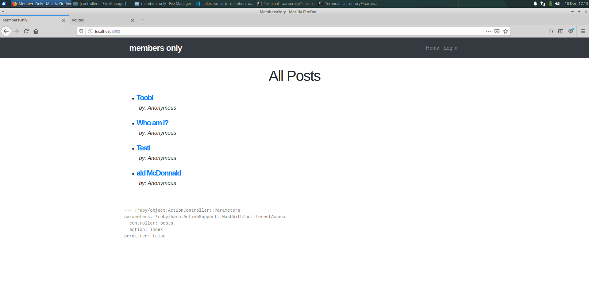

# Members Only

> In this project, we built an app that allows users to login, sign up and create posts but only users who are logged in are allowed to view who created the posts.

## Built With

- Ruby
- Ruby on Rails, Bootstrap
- Gems: bcrypt

### Requirements

* Ruby 2.6.3

### Installation

* Download repository to your local machine, then run `bundle install` and run `rails db:migrate`.

## Authors

👤 **Aaron Rory**

- Github: [@Aaron-RN](https://github.com/Aaron-RN)
- Twitter: [@ARNewbold](https://twitter.com/ARNewbold)
- Linkedin: [Aaron Newbold](https://www.linkedin.com/in/aaron-newbold-1b9233187/)

👤 **Thaís Vieira Azevedo**

- Github: [@thsvr](https://github.com/githubhandle)
- Twitter: [@vr_ths](https://twitter.com/vr_ths)
- Linkedin: [Thaís V.](https://www.linkedin.com/in/vr-ths-zd/)

## 🤝 Contributing

Contributions, issues and feature requests are welcome!

Feel free to check the [issues page](issues/).

## Show your support

Give a ⭐️ if you like this project!

## 📝 License

This project is [MIT](lic.url) licensed.
